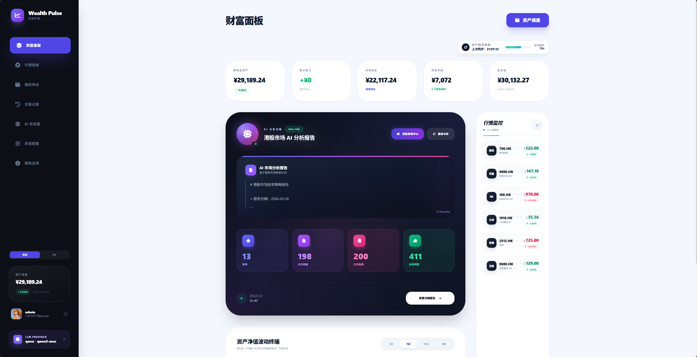
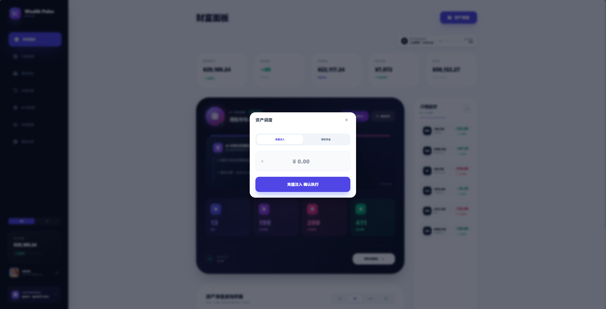
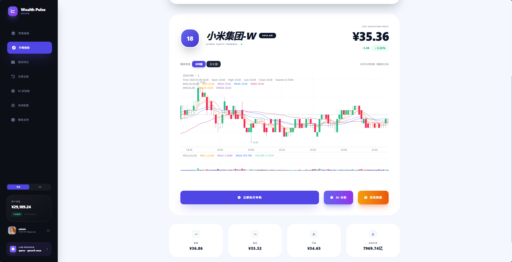
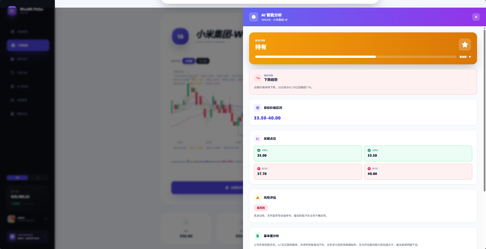
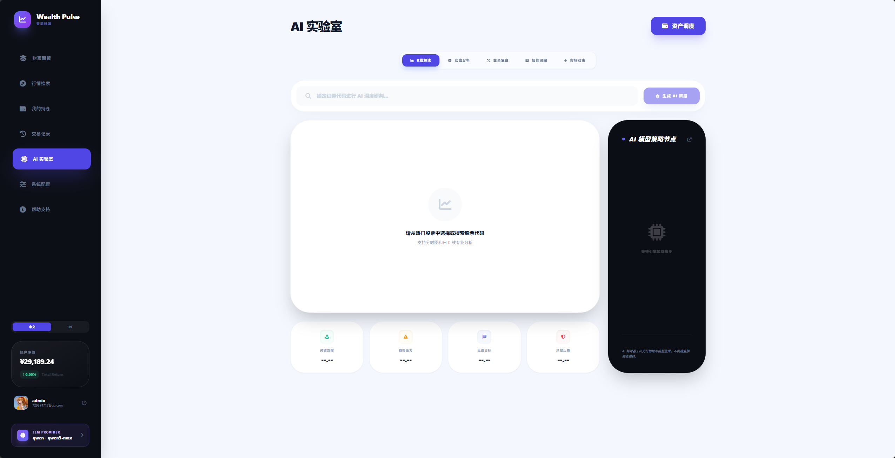
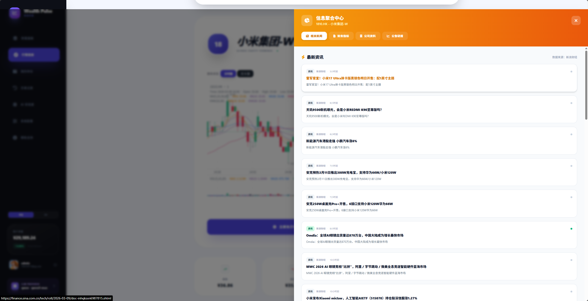
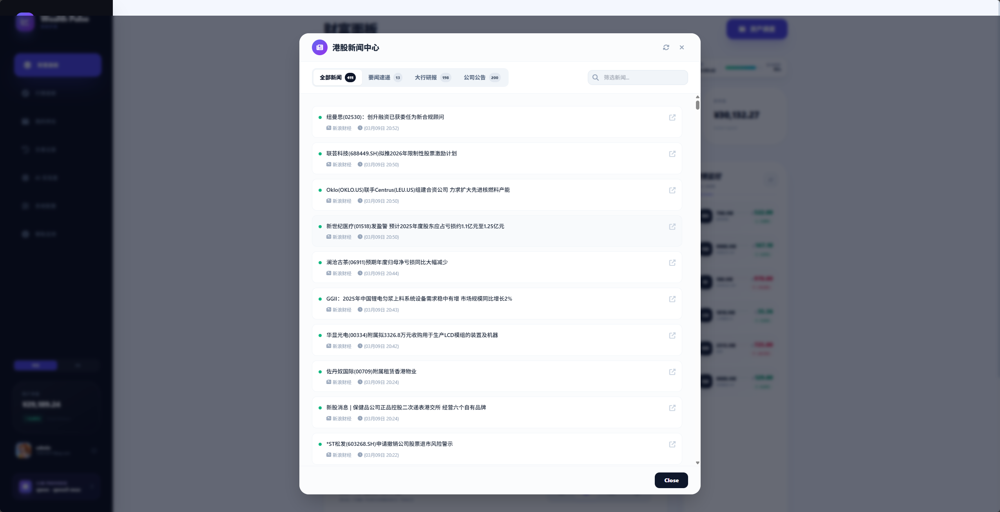
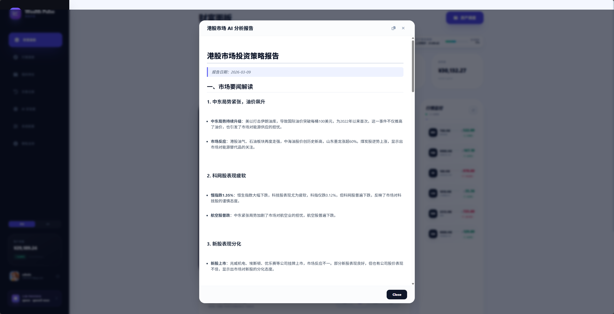

# Wealth Pulse

> 港股投资跟踪与 AI 辅助分析平台

[](https://openjdk.org/)
[](https://spring.io/projects/spring-boot)
[](https://react.dev/)
[](https://www.typescriptlang.org/)

**语言:** [English](./README.md) | 中文

---

## 简介

**Wealth Pulse** 是一个专为港股投资者设计的全栈投资跟踪平台，整合了：

- **后端 API** (Spring Boot) - 基于 JWT 认证的 RESTful 服务
- **前端 Web** (React + TypeScript) - 交互式仪表盘与 AI 智能分析
- **Python 脚本** - 股票数据获取与处理工具

---

## 项目结构

```
wealth-pulse/
├── wealth-pulse-api/       # Java Spring Boot 后端
├── wealth-pulse-web/       # React TypeScript 前端
├── wealth-pulse-python/    # Python 股票数据服务
├── sql/                    # 数据库脚本
└── docs/                   # 文档与截图
```

---

## 页面截图

### 仪表盘


### 财富分析


### K 线图


### AI 分析



### 新闻与报告




---

## 快速开始

### 前置要求

- **Java 17+**
- **Node.js 18+**
- **Python 3.10+**
- **MySQL 8.0+**
- **Redis 7+**
- **Gemini API Key** (用于 AI 功能)

### 1. 后端 API

```bash
cd wealth-pulse-api

# 在 src/main/resources/application-dev.yml 中配置数据库
mvn clean package
mvn spring-boot:run

# API 运行在 http://localhost:9090
# Swagger UI: http://localhost:9090/swagger-ui.html
```

### 2. Python 股票服务

```bash
cd wealth-pulse-python

pip install -r requirements.txt
cp .env.example .env
# 编辑 .env 配置你的数据库和 API 凭证

# 使用 Docker 运行
docker-compose up -d
# 或直接运行
python -m app.main

# API 运行在 http://localhost:8000
```

### 3. 前端应用

```bash
cd wealth-pulse-web

pnpm install
echo "GEMINI_API_KEY=your_api_key_here" > .env
pnpm dev

# Web 应用运行在 http://localhost:9000
```

---

## 功能特性

### 后端 API (Spring Boot)

- **认证授权**: 基于 JWT 的无状态认证
- **用户管理**: 注册、登录、OAuth (Google)
- **投资组合跟踪**: 持仓、交易记录、资金流向
- **市场数据**: 实时和历史股票数据
- **AI 集成**: Google Gemini 交易分析
- **文件存储**: AWS S3 / Cloudflare R2
- **邮件通知**: Resend 邮件服务
- **API 文档**: Swagger/OpenAPI

### Python 服务

- **股票数据提供商**: yfinance 集成港股/美股数据
- **数据持久化**: MySQL + SQLAlchemy ORM
- **缓存**: Redis 高性能数据访问
- **定时任务**: 自动刷新市场数据
- **JWT 认证**: 安全的 API 访问
- **Docker 支持**: 容器化部署

### 前端 Web (React)

- **仪表盘**: 资产概览与交互式图表
- **持仓管理**: 仓位跟踪和盈亏计算
- **交易记录**: 买入/卖出历史
- **资金流向**: 存取款跟踪
- **AI 实验室**: 交易评分和 AI 市场洞察
- **市场搜索**: 实时报价和快捷交易
- **多语言**: 中文/英文支持
- **响应式设计**: 移动端友好界面

---

## 技术栈

### 后端 API

| 组件 | 技术 |
|------|------|
| 框架 | Spring Boot 3.5.5 |
| 语言 | Java 17 |
| 数据库 | MySQL + MyBatis-Plus 3.5.14 |
| 缓存 | Redis + Redisson |
| 安全 | Spring Security + JWT |
| 存储 | AWS S3 / Cloudflare R2 |
| 文档 | SpringDoc OpenAPI 2.8.12 |
| 邮件 | Resend Java SDK 4.6.0 |
| OAuth | Google API Client 2.8.1 |

### Python 服务

| 组件 | 技术 |
|------|------|
| 框架 | FastAPI 0.115.0 |
| 语言 | Python 3.10+ |
| 数据库 | MySQL + SQLAlchemy 2.0 |
| 缓存 | Redis |
| 调度器 | APScheduler 3.10 |
| 数据源 | yfinance 0.2.50 |
| 认证 | JWT (python-jose) |

### 前端 Web

| 组件 | 技术 |
|------|------|
| 框架 | React 19 |
| 语言 | TypeScript 5.8 |
| 构建 | Vite 6 |
| 图表 | Recharts 3.7 |
| AI | @google/genai 1.38 |

---

## API 接口

### 后端 API (端口 9090)

| 方法 | 接口 | 描述 |
|------|------|------|
| POST | /api/auth/login | 用户登录 |
| POST | /api/auth/register | 用户注册 |
| GET | /api/positions | 获取用户持仓 |
| POST | /api/transactions | 创建交易记录 |
| GET | /api/assets/summary | 资产概览 |
| POST | /api/ai/analyze | AI 交易分析 |

### Python 服务 (端口 8000)

| 方法 | 接口 | 描述 |
|------|------|------|
| POST | /api/auth/token | 获取 JWT 令牌 |
| GET | /api/stocks/ | 股票列表 |
| GET | /api/stocks/{code}/market-data | 当前市场数据 |
| GET | /api/stocks/{code}/history | 历史数据 |
| POST | /api/stocks/refresh | 刷新市场数据 |

---

## 配置

### 后端 (.env)
```bash
SPRING_DATASOURCE_URL=jdbc:mysql://localhost:3306/wealth_pulse
SPRING_DATASOURCE_USERNAME=root
SPRING_DATASOURCE_PASSWORD=your_password
SPRING_REDIS_HOST=localhost
SPRING_REDIS_PORT=6379
JWT_SECRET=your_jwt_secret_key
```

### Python (.env)
```bash
DB_HOST=localhost
DB_PORT=3306
DB_USER=root
DB_PASSWORD=your_password
REDIS_HOST=localhost
API_SECRET_KEY=your_secret_key_min_32_chars
```

### 前端 (.env)
```bash
GEMINI_API_KEY=your_gemini_api_key
```

---

## 开发

### 启动所有服务

```bash
# 终端 1 - 后端
cd wealth-pulse-api && mvn spring-boot:run

# 终端 2 - Python 服务
cd wealth-pulse-python && docker-compose up -d

# 终端 3 - 前端
cd wealth-pulse-web && pnpm dev
```

### 访问地址

- **前端**: http://localhost:9000
- **后端 API**: http://localhost:9090
- **后端 Swagger**: http://localhost:9090/swagger-ui.html
- **Python API**: http://localhost:8000
- **Python Swagger**: http://localhost:8000/docs

---

## 文档

- [后端开发指南](./CLAUDE.md#backend-development-wealth-pulse-api)
- [前端开发指南](./CLAUDE.md#frontend-development-wealth-pulse-web)
- [Python 服务指南](./wealth-pulse-python/README.md)

---

## 贡献

欢迎贡献！请随时提交 Pull Request。

---

## 许可证

MIT License

---

## 支持

如有问题或建议，请在 GitHub 上提交 issue。
