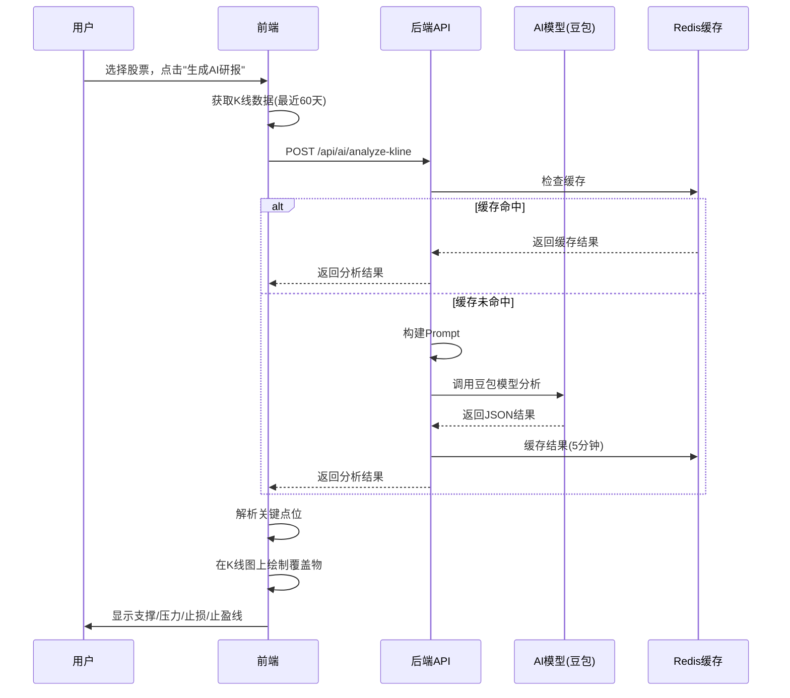

# AI K 线图点位分析功能

## 功能概述

实现前端传 K 线数据到后端，后端 AI 模型分析后回传关键点位，前端在 K 线图上覆盖显示这些点位。

## 技术栈

- **前端**: React + TypeScript + klinecharts
- **后端**: Spring Boot 3 + 火山引擎 Ark (豆包模型)
- **缓存**: Redis (TTL 5分钟)

## 文件清单

### 前端文件

1. **`services/aiAnalysis.ts`** - AI 分析 API 客户端
   - 定义数据类型（AIAnalysisRequest, AIAnalysisResponse, KeyLevel）
   - 封装 API 调用

2. **`components/StockChartWithOverlay.tsx`** - 增强 K 线图组件
   - 继承原 StockChartDay 功能
   - 支持显示 AI 分析点位覆盖物（价格线）
   - 自定义点位颜色和标签

3. **`components/AILab/InterpretationTab.tsx`** - AI 实验室页面
   - 集成 AI 分析功能
   - 显示点位开关
   - 点位说明卡片

### 后端文件

1. **`docs/ai-analysis-controller-example.java`** - Controller 示例
2. **`docs/ai-analysis-dto-example.java`** - 请求 DTO
3. **`docs/ai-analysis-response-example.java`** - 响应 DTO
4. **`docs/ai-analysis-service-example.java`** - Service 实现示例

## 工作流程



## 数据格式

### 请求示例

```json
{
  "symbol": "00700.HK",
  "period": "daily",
  "klineData": [
    {
      "timestamp": 1704067200000,
      "open": 150.5,
      "high": 152.3,
      "low": 149.8,
      "close": 151.2,
      "volume": 12500000
    }
  ],
  "language": "zh"
}
```

### 响应示例

```json
{
  "symbol": "00700.HK",
  "analysis": {
    "keyLevels": [
      {
        "type": "support",
        "price": 148.5,
        "label": "关键支撑",
        "confidence": 0.85,
        "reason": "多次回踩支撑位"
      },
      {
        "type": "resistance",
        "price": 155.8,
        "label": "趋势压力",
        "confidence": 0.78,
        "reason": "前期高点压力"
      },
      {
        "type": "takeProfit",
        "price": 160.5,
        "label": "止盈目标",
        "confidence": 0.72,
        "reason": "趋势线上方"
      },
      {
        "type": "stopLoss",
        "price": 146.2,
        "label": "风控止损",
        "confidence": 0.90,
        "reason": "跌破支撑位"
      }
    ],
    "trend": "bullish",
    "patterns": ["底部盘整", "量价背离"],
    "advice": "当前处于筑底阶段，建议轻仓分批入场。",
    "confidence": 0.81
  }
}
```

## klinecharts 覆盖物实现

### 支持的覆盖物类型

- **priceLine** - 价格线（推荐，带标签）
- **horizontalLine** - 水平线
- **segment** - 线段
- **rayLine** - 射线

### 颜色配置

```typescript
const colors = {
  support: '#10b981',   // 绿色 - 支撑位
  resistance: '#ef4444', // 红色 - 压力位
  stopLoss: '#f59e0b',   // 橙色 - 止损位
  takeProfit: '#6366f1', // 紫色 - 止盈位
};
```

### 创建覆盖物代码

```typescript
chartInstance.createOverlay({
  name: 'priceLine',
  id: 'support-148.5',
  points: [{ timestamp: Date.now(), value: 148.5 }],
  styles: {
    line: {
      color: '#10b981',
      size: 2,
      style: 'dashed',
    },
    text: {
      color: '#10b981',
      size: 12,
      weight: 'bold',
    },
  },
});
```

## 后端实现要点

### 1. Prompt 设计

```java
StringBuilder sb = new StringBuilder();
sb.append("你是一位专业的股票技术分析专家。\n\n");
sb.append("股票代码: ").append(symbol).append("\n");
sb.append("最近60根K线数据:\n");

// 添加K线数据...

sb.append("\n请以JSON格式返回分析结果：\n");
sb.append("{\n");
sb.append("  \"keyLevels\": [\n");
sb.append("    { \"type\": \"support\", \"price\": 148.5, \"label\": \"关键支撑\", \"confidence\": 0.85, \"reason\": \"多次回踩\" }\n");
sb.append("  ],\n");
sb.append("  \"trend\": \"bullish\",\n");
sb.append("  \"patterns\": [...],\n");
sb.append("  \"advice\": \"...\",\n");
sb.append("  \"confidence\": 0.81\n");
sb.append("}\n");
```

### 2. Redis 缓存策略

```java
String cacheKey = String.format("ai:kline:%s:%s:%d",
    symbol, period, firstKlineTimestamp);

AIAnalysisResponse cached = redisTemplate.opsForValue().get(cacheKey);
if (cached != null) {
    return cached;
}

AIAnalysisResponse response = callAIModel(request);
redisTemplate.opsForValue().set(cacheKey, response, 5, TimeUnit.MINUTES);
```

### 3. JSON 解析

```java
ObjectMapper mapper = new ObjectMapper();
JsonNode root = mapper.readTree(aiResponse);

// 提取 keyLevels
JsonNode levelsNode = root.get("keyLevels");
for (JsonNode levelNode : levelsNode) {
    KeyLevel level = new KeyLevel();
    level.setType(levelNode.get("type").asText());
    level.setPrice(levelNode.get("price").asDouble());
    // ...
}
```

## 前端使用示例

```tsx
// 1. 调用 AI 分析
const handleAnalyze = async () => {
  const klineData = await stockApi.getEnhancedHistory(symbol, {...});

  const request: AIAnalysisRequest = {
    symbol,
    period: 'daily',
    klineData: klineData.map(item => ({
      timestamp: new Date(item.tradeDate).getTime(),
      open: item.openPrice,
      high: item.highPrice,
      low: item.lowPrice,
      close: item.closePrice,
      volume: item.volume,
    })),
    language: 'zh',
  };

  const response = await aiAnalysisApi.analyzeKline(request);
  setKeyLevels(response.analysis.keyLevels);
};

// 2. 在图表中显示
<StockChartWithOverlay
  stockCode={symbol}
  height={500}
  keyLevels={keyLevels}
  showOverlays={true}
/>
```

## 性能优化

1. **数据量控制**: 只发送最近 60 根 K 线
2. **Redis 缓存**: TTL 5分钟，避免重复调用
3. **前端缓存**: 使用 useState 避免重复请求
4. **异步处理**: 使用 async/await，不阻塞 UI

## 扩展功能

### 未来可扩展的方向

1. **更多覆盖物类型**: 趋势线、斐波那契回撤等
2. **交互式覆盖物**: 允许用户拖动调整点位
3. **点位历史记录**: 保存历史分析结果对比
4. **多模型对比**: 同时调用多个 AI 模型，展示不同分析
5. **实时更新**: WebSocket 推送最新分析结果

## 测试建议

1. **单元测试**: 测试 JSON 解析逻辑
2. **集成测试**: 测试完整流程（K线获取 → AI分析 → 覆盖物显示）
3. **边界测试**: 测试无数据、错误数据等情况
4. **性能测试**: 测试并发请求、大量K线数据

## 注意事项

1. **AI 结果仅供参考**: 需要明确风险提示
2. **数据安全**: K线数据可能敏感，注意加密传输
3. **成本控制**: AI 模型调用有成本，注意缓存策略
4. **错误处理**: AI 模型可能失败，需要降级方案
